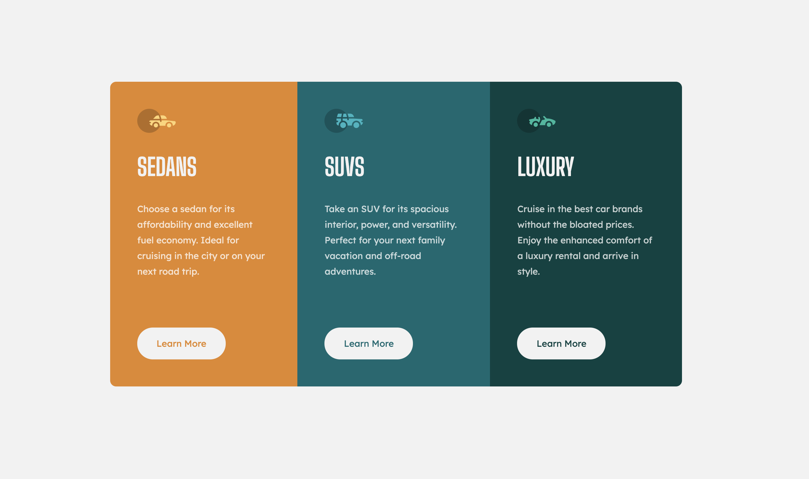

# Frontend Mentor - 3-column preview card component solution

This is a solution to the [3-column preview card component challenge on Frontend Mentor](https://www.frontendmentor.io/challenges/3column-preview-card-component-pH92eAR2-). Frontend Mentor challenges help you improve your coding skills by building realistic projects. 

## Table of contents

- [Overview](#overview)
  - [The challenge](#the-challenge)
  - [Screenshot](#screenshot)
  - [Links](#links)
- [My process](#my-process)
  - [Built with](#built-with)
  - [What I learned](#what-i-learned)
  - [Continued development](#continued-development)
  - [Useful resources](#useful-resources)

## Overview

### The challenge

Users should be able to:

- View the optimal layout depending on their device's screen size
- See hover states for interactive elements

### Screenshot




### Links

- Live Site URL: [Live site URL](https://emilyw12.github.io/3-column-card/)

## My process

### Built with

- Semantic HTML5 markup
- CSS
- Flexbox
- Mobile-first workflow

### What I learned

This is my third completed Frontend Mentor challenge. I wanted to practice responsive layout and typography and being intentional with using rem vs em. I learned that generally rem units should be used so that most elements scale with the root font size, but em units are used for elements that should scale with their parent container, like buttons. Additionally, each time I work with flexbox, I learn something new. There isn't a way to make one specific element align with the end of the container along the main axis, but ```margin: auto``` lets you do that in the direction you want. I used this to align the "Learn More" element to the bottom of the flex container for each column:

```css
.card__col {
	display: flex;
	flex-direction: column;
	align-items: flex-start;
}

.card__btn {
	margin-top: auto;
}

```


### Continued development

I'm going to continue practicing responsiveness and layouts with more challenges. I'm planning to learn about CSS grid soon and practice with it in my future challenges.


### Useful resources

- [CSS Tricks - Flexbox and auto margins](https://css-tricks.com/the-peculiar-magic-of-flexbox-and-auto-margins/) - This helped me discover the trick of aligning one particular item inside a flex container along the main axis.
- [When to Use Em Vs. Rem](https://webdesign.tutsplus.com/tutorials/comprehensive-guide-when-to-use-em-vs-rem--cms-23984) - This helped clarify specific cases for when to use rem vs em.